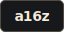
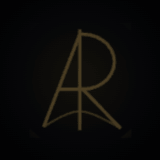

  

  

    <a href="https://abdullahraheel.dev/en/work"><strong>View my work</strong></a>
    ·
    <a href="https://abdullahraheel.dev/en/blog"><strong>Read my articles</strong></a>
    ·
    <a href="https://linkedin.com/in/abdullahraheel"><strong>LinkedIn</strong></a>
    ·
    <a href="mailto:abdullaharaheel@gmail.com"><strong>Email</strong></a>
  

I build product, platform, and AI systems across the stack, with a current focus on Go, backend architecture, and systems engineering.

  <strong>Currently at</strong>
    
  
   
  <strong>Covent</strong> 
  Senior Frontend Engineer → Team Lead
  

    Lead a team of three, own frontend architecture, and ship backend systems, standards, and client onboarding. 
    Built Covent MCP from pitch to production in Go and rendered 100,000 property markers in WebGL.
  

 

  <strong>Previously at</strong>
    
  
   
  <strong>Metal</strong> 
  

    Owned end-to-end work across data operations, communications, draft persistence, and platform tooling. 
    Delivered the version-controlled DataOps Portal in 20 days and built a multi-level draft system with Redis.
  

  Backed by
    
  <a href="https://www.ycombinator.com/companies/metal-2">
    
    &nbsp;<strong>Y Combinator</strong>
  </a>
  &nbsp;&nbsp;·&nbsp;&nbsp;
  <a href="https://speedrun.a16z.com/companies/metal">
    
    &nbsp;<strong>a16z</strong>
  </a>

## Stack

- **Backend and data:** Go, `net/http`, Django, PostgreSQL, Redis, NestJS
- **Product engineering:** React, TypeScript, Next.js, XState, Zustand, Mapbox WebGL
- **Delivery and quality:** AWS EC2, Docker, GitHub Actions, Vercel, Sentry, Vitest, Playwright

  
   
  <a href="https://abdullahraheel.dev/en"><strong>abdullahraheel.dev</strong></a>

