

  

  

    <a href="https://abdullahraheel.dev/en/work"><strong>Work</strong></a>
    ·
    <a href="https://abdullahraheel.dev/en/blog"><strong>Writing</strong></a>
    ·
    <a href="https://abdullahraheel.dev/en"><strong>Portfolio</strong></a>
    ·
    <a href="https://linkedin.com/in/abdullahraheel">LinkedIn</a>
    ·
    <a href="mailto:abdullaharaheel@gmail.com">Email</a>
  

## About

I have spent five years shipping customer-facing products, backend services, data systems, live migrations, and infrastructure. I currently lead a team of three at Covent while moving deeper into Go, backend architecture, and systems engineering.

## Experience

<h3></h3>

**Senior Frontend Engineer → Team Lead · 2025–Present**

- Lead and mentor three engineers as frontend code owner, reviewing product and architecture work while remaining hands-on in the codebase.
- Proposed and led Covent MCP from idea to production: 23 read-only Go tools with OAuth 2.0 and PKCE, PostgreSQL state, analytics, and EC2 delivery.
- Replaced precomputed multi-agent message generation with an on-demand flow, cutting model calls by 96% and monthly spend from about $9,000 to about $700.
- Cut first-load JavaScript by 26–40% across six routes, including onboarding from 482 to 295 kB and listing campaigns from 808 to 487 kB.

<h3></h3>

**Fullstack Engineer · 2024–2025**

- Owned end-to-end work across data operations, communications, draft persistence, frontend education, and platform tooling.
- Delivered a version-controlled DataOps Portal in 20 days with arbitrary table rendering, snapshots, field-level overrides, and relational data.
- Built a multi-level note-draft system across frontend and backend with Redis persistence and a localStorage fallback.
- Shipped the Communications Module on deadline and led Frontend 101 sessions for backend engineers on browser rendering, React internals, and Next.js.

**Backed by**

  
  <a href="https://speedrun.a16z.com/companies/metal">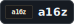</a>

## Stack

**Backend and data**

  
  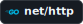
  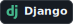
  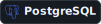
  
  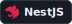

**Product engineering**

  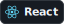
  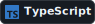
  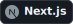
  
  
  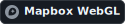

**Delivery and quality**

  
  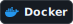
  
  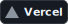
  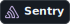
  
  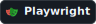

